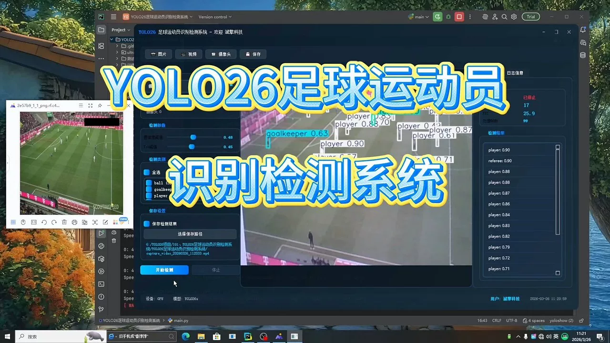
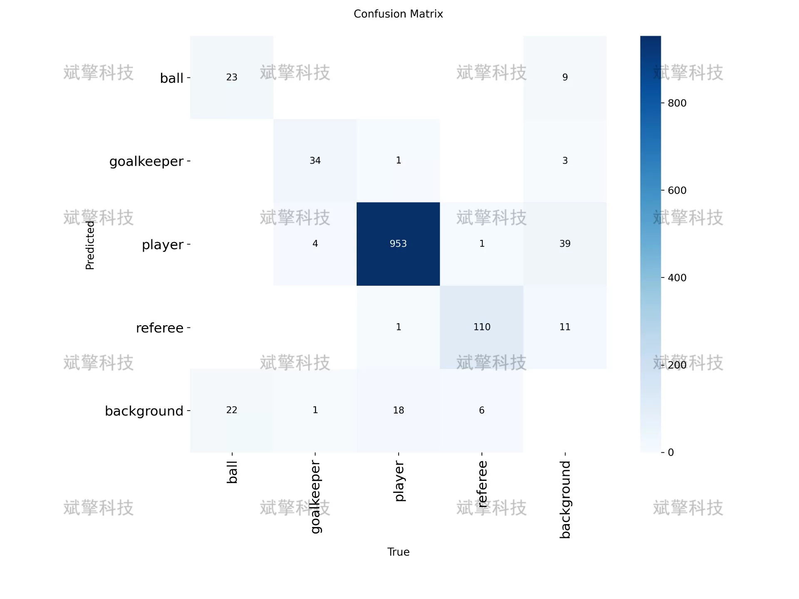
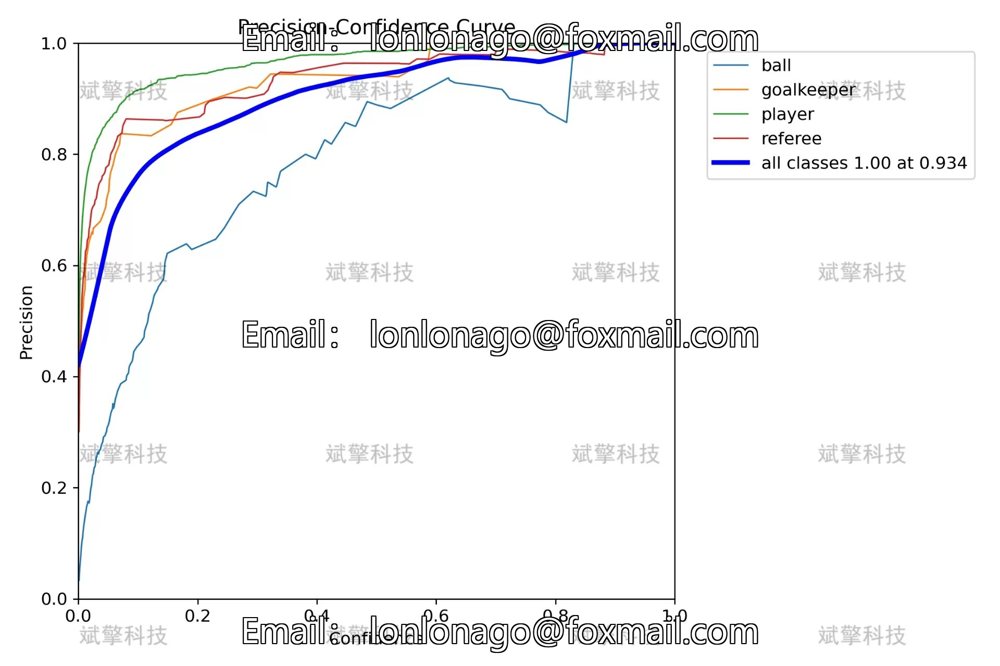
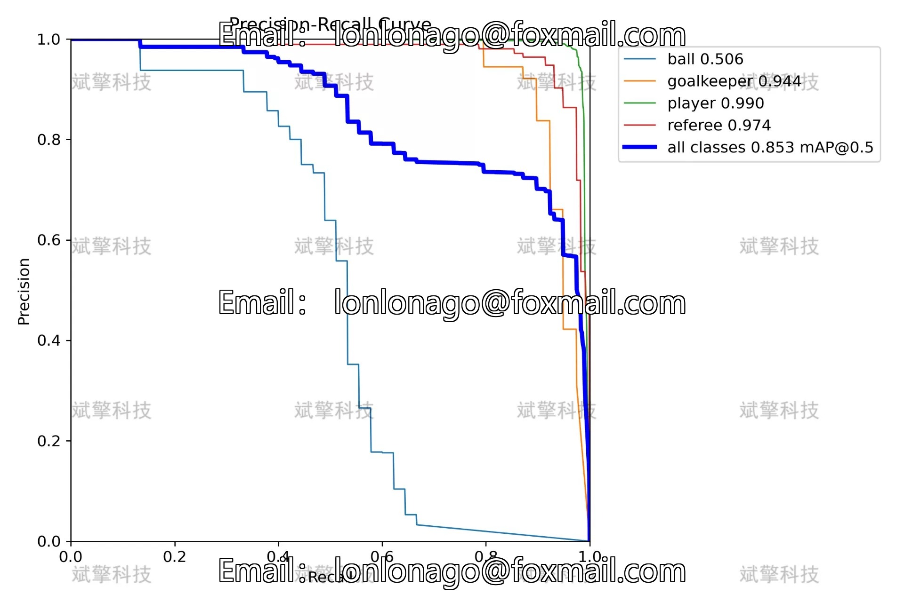
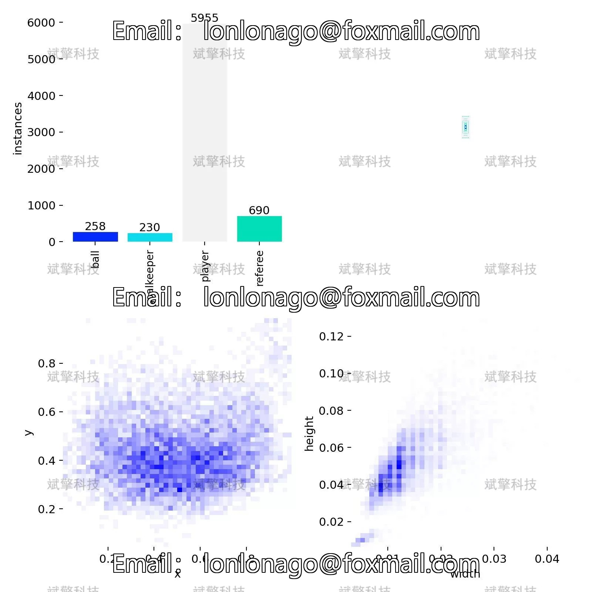
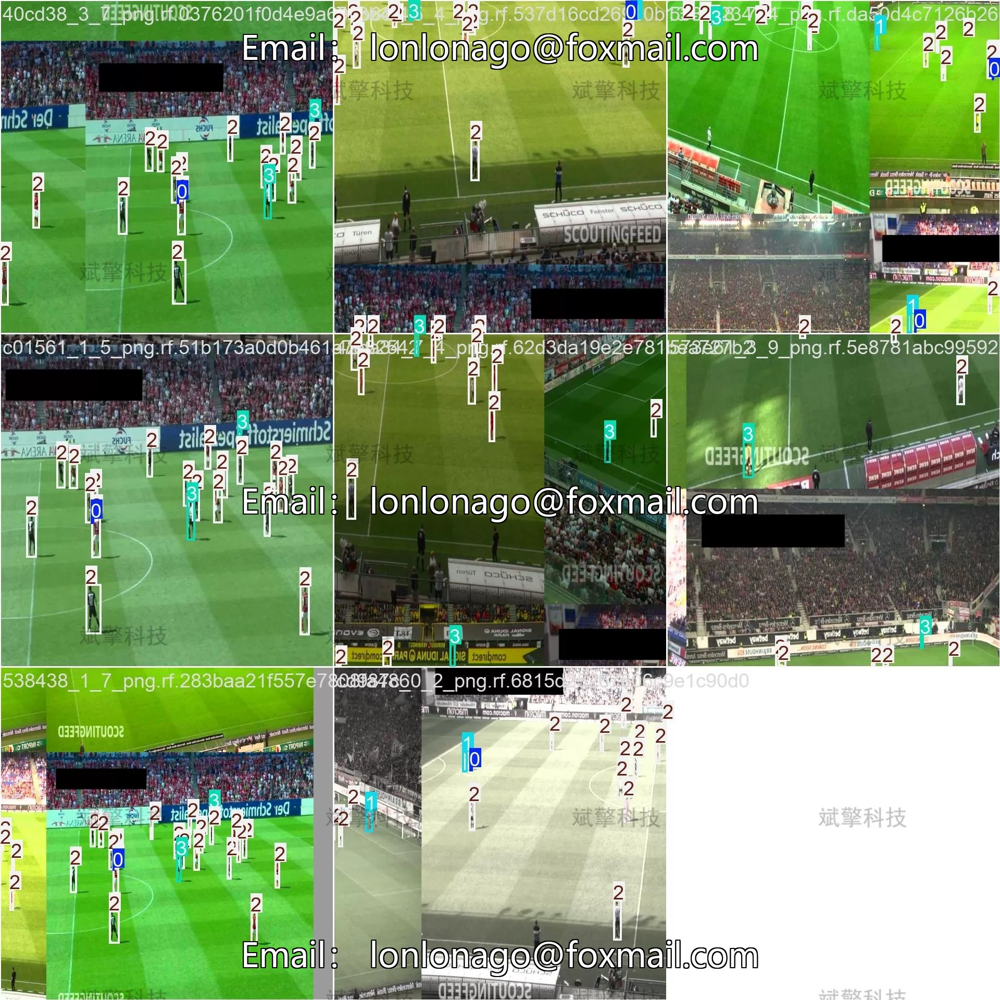
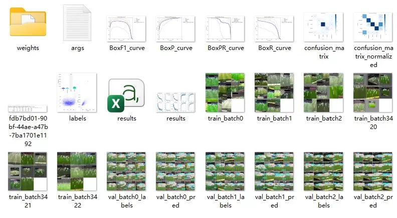
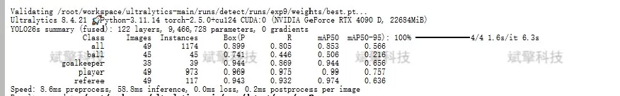
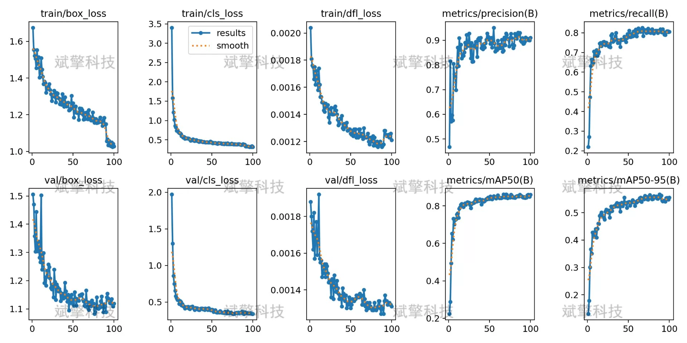

# YOLOv26 Football Player Detection System | Source Code

## Body

YOLO26 Football Player Detection System | Source Code, Dataset, Model Weights, UI Interface, Python, Deep Learning, and Remote Deployment for Multi-Object Detection in Football Matches: Real-time recognition of players, goalkeepers, referees, and football (Project Source Code + Dataset + Model Weights + UI Interface + Python + Deep Learning + Remote Deployment)

Football, as one of the most popular sports worldwide, has significant implications for tactical research, athlete evaluation, and match refereeing. This paper builds a football player recognition detection system based on the YOLO object detection algorithm to automatically detect and locate four types of targets in a game scene: football, goalkeepers, players, and referees. The system employs the YOLO26 architecture and is trained and evaluated on 372 labeled images (298 training set, 49 validation set, 25 test set). Experimental results show that the model performs excellently in player and referee detection with mAP50 values of 0.99 and 0.974 respectively, while the mAP50 for goalkeeper detection is 0.944, achieving an overall average accuracy of 0.853. Despite the challenges faced by small target detection (mAP50 of 0.506), the system demonstrates good robustness and practical value. This study provides technical support for the automated analysis of football matches and serves as a reference direction for optimization of small target detection.

The football target detection dataset constructed in this study includes four categories: football (ball), goalkeeper (goalkeeper), player (player), and referee (referee).
The dataset consists of 372 images, divided into training set (298), validation set (49), and test set (25) at a ratio of approximately 8:1:1.

Free remote installation reservation. Unsuccessful full refund.
Purchase comes with the following resources (auto unlocked in Baidu Cloud):
   - Complete source code for YOLO recognition detection project
   - YOLO format dataset
   - Training code + UI interface code
   - Trained model + result images
   - Software install package
   - Add WeChat reservation for remote installation (automatically displayed WeChat ID after purchase) - Unsuccessful, full refund

⚙️ Core Function Modules
Detection Capability
    Image Detection: Upon upload, returns detection boxes + category information
    Video Detection: Supports video files, analyzes frames accurately
    Camera Real-time Detection: Connects to USB camera for dynamic monitoring
Interaction and Control
    Target Filtering: Choose one or more categories for detection
    Parameter Real-time Adjustment: Adjustable confidence threshold & IoU threshold, flexible control of precision
    Result Save: One-click save of image/video/camera detection results
System and Data
    User login registration: Supports password strength check + encryption storage
    Log recording: Auto records operation and error information (timestamped)

## Images

## Payment

Here is a pay link on Stripe ( https://buy.stripe.com/3cs8yP7sY87d0vu9AB ). Please contact me lonlonago@foxmail.com after funding $89, and I will send you a complete data files , thank you!

